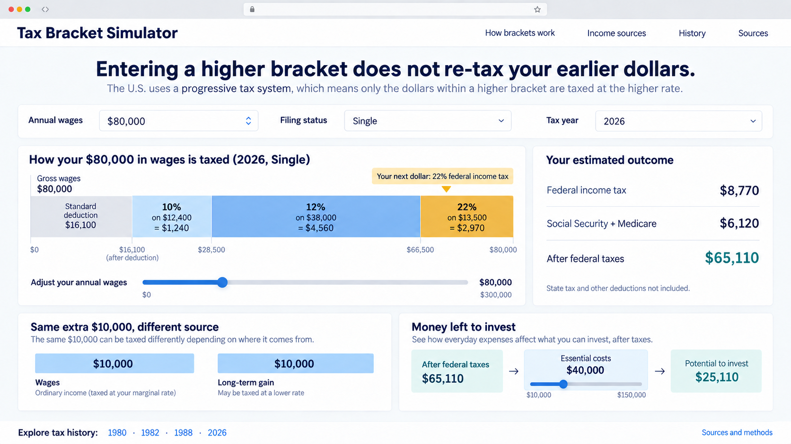

# Tax Bracket Simulator

An interactive, plain-language U.S. tax dashboard in planning. Its first lesson is simple: **entering a higher tax bracket does not raise the rate on dollars already earned.** The dashboard will then show how wages and investment gains can follow different rules, and how after-tax income and essential costs affect the amount available to invest.

**Status:** project brief and visual reference. The simulator has not been implemented or released. The [interface image](docs/interface-reference.png) is a concept, not a working or validated tax calculator.

**Reference project:** [From Barrel to Pump](https://github.com/leecoursey/from-barrel-to-pump). This project should use the same lightweight approach: static HTML, CSS, and JavaScript; GitHub Pages; versioned public data; visible source dates; and a detailed source register. No code from that repository is included in this planning snapshot.

## Questions this project should answer

The full [question-led user stories and acceptance checks](docs/QUESTIONS.md) are the product contract. A visitor should be able to answer:

1. If my income crosses into a higher bracket, do my earlier dollars get taxed again at the higher rate?
2. Exactly how many of my dollars fall in each bracket, and how much tax does each slice produce?
3. If I earn another $1, $1,000, or $10,000, how much do I keep?
4. How are wages, short-term gains, long-term gains, and qualified dividends treated differently in the *same* situation?
5. What is a realized gain, and why is a sale price different from a taxable profit?
6. How much remains after federal income and payroll taxes, a supported state tax, and user-entered essential costs?
7. When does the amount available to invest reach zero, and how does that change an illustrated wealth-growth path?
8. What changed in federal ordinary-income and capital-gains rules across the last century, especially 1980, 1982, and 1988?
9. Where did every displayed rate, threshold, historical claim, and example input come from?

## Planned experience

1. **Brackets:** drag annual wages or type an amount. Watch taxable dollars fill labeled bracket bins from the bottom up. Highlight only the new slice when income changes. Show marginal and effective federal income-tax rates as distinct numbers.
2. **Income source:** hold a base situation fixed and compare the same additional dollars as wages, a short-term gain, a long-term gain, or a qualified dividend. Show any applicable payroll tax and net investment income tax separately. Do not imply that every investment receipt receives a preferential rate.
3. **Money left:** show wages and realized gains, taxes, after-tax income, editable essential costs, and investable surplus. A growth illustration uses explicit contribution and return assumptions, with no promised outcome.
4. **History:** a 1926–2026 sourced timeline, plus a few fully modeled tax-year snapshots. The first detailed comparison should include 1980, 1982, and 1988. Historical state/local tax is outside the initial comparison.

The modern calculator should start with one published tax year, ordinary employee wages, standard deduction, and clearly defined capital-gain cases. State tax should appear only for jurisdictions whose taxable base, rates, deductions, and relevant credits have been verified from official instructions. Local tax is a separately verified extension. The interface must never apply a state's headline rate directly to gross wages and label the result a personal estimate.

## Visual reference

See [visual design notes](docs/DESIGN.md) for the intended interaction and the illustration's assumptions. The sample $80,000 single-filer federal calculation in the image uses 2026 IRS and SSA values. Its $40,000 essential-cost entry is a **fictional user input**, not a national statistic. The image was generated with OpenAI's built-in image-generation tool using the `ui-ux-pro-max` skill for design guidance; exact prompt and credits are in [DESIGN.md](docs/DESIGN.md).

## Source and credit policy

The [source register](docs/SOURCES.md) lists every source identified for this planning release and identifies which are official rules, contextual research, or design inputs. Future datasets must be added there with publisher, URL, tax year or observation period, retrieval date, used fields, transformations, and limitations. Every on-screen number and historical assertion must link to its source or to a documented calculation from sourced values. User-entered and illustrative assumptions must be labeled as such. Original source organizations retain credit for their data and research.

## Next build steps

See [implementation plan](docs/IMPLEMENTATION.md). The first release should prioritize the bracket misconception and source transparency before adding broad geographic or historical coverage.
